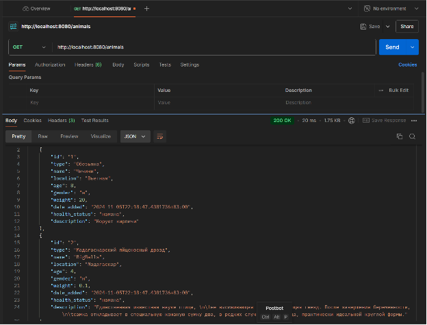
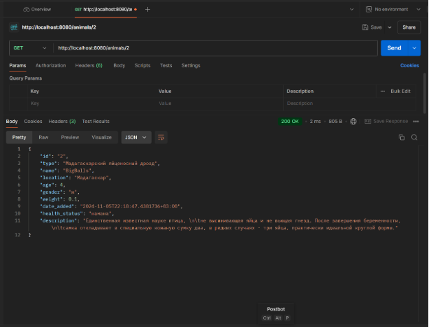
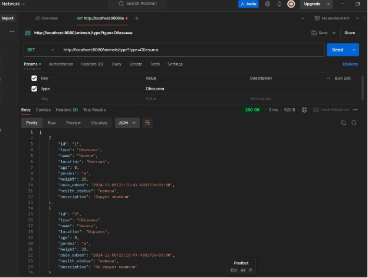
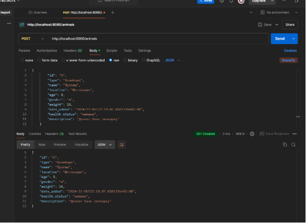
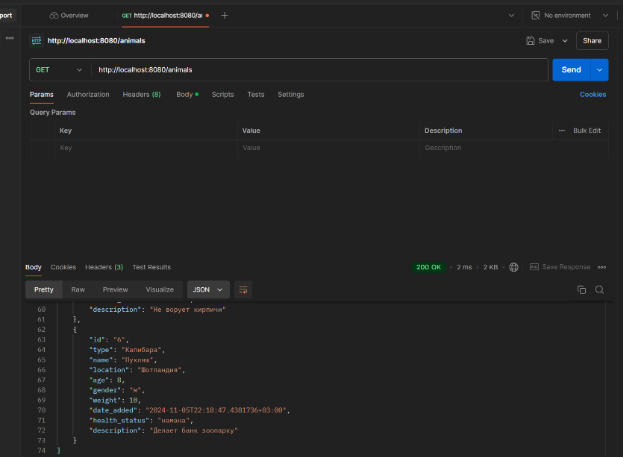
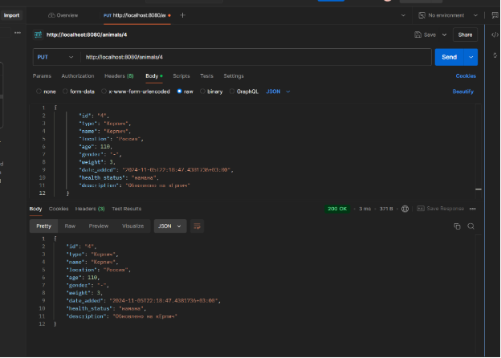
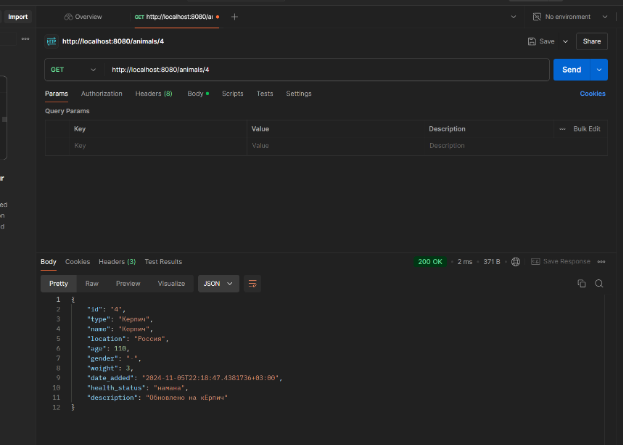

# IndustrialTechnology

Практические работы по дисциплине Технологии индустриального программирования  
Иванов Вячеслав, ЭФМО-01-24
## Практика 6. 
# GET 

* GET по списку
  

* GET по ID
  

* GET по типу
  

* GET по количеству животных
  

# POST 

# PUT

# DELETE

